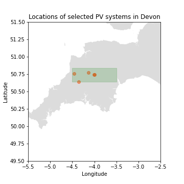
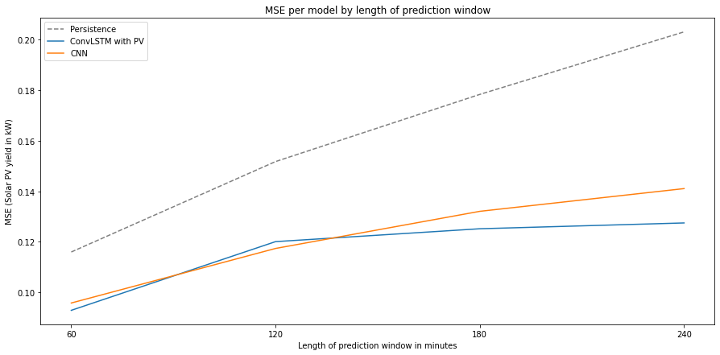

# Dissertation

This dissertation seeks to use satellite imagery to predict solar photovoltaic (PV) yield - the energy from solar panels, using satellite images. I combine two data sources: PV energy readings - from around 1300 sites shown below, and satellite images. 

<p align="center">
  
</p>


The satellite images are from EUMETSAT, the EUMETSAT Spinning Enhanced Visible and InfraRed Imager (SEVIRI) rapid scanning service (RSS) takes an image of the northern third of the Meteosat disc every five minutes. The original dataset was around 100GB, so cropped to only include Devon (100x100x170K) dataset to make training easier. 


Full size image                   |   Area crop                | Smaller crop used in training
:---------------------------------:|:-------------------------:|:------------------------------------:|
  |  | 

## Preprocessing

I chose some PV sites in the area of the satellite image crop, in Devon, and used the PV readings from those locations from 2020 and 2021. I then matched this up with the satellite images. 



. 

I then had a look at the images and realised that a lot were dark 


So I removed the ones where the solar altitude (the angle relative to the ground of the sun in the sky) was below 10 degrees - we can see that at least over short time scales solar altitude appears correlated with PV yield. 


## Models

I then tested a few different neural networks, mainly comparing CNNs and ConvLSTMs. I also tested taking inputs as: satellite images only, prior PV readings only, and prior PV and satellite images. In order to predict sequences of different lengths, I padded some of the batches. 

```
def convlstm_padded(steps_forward, x_train_sat_padded, x_train_pv_inputs_padded, y_train, 
                                   x_test_sat_padded, x_test_pv_inputs_padded, y_test, 
                                   x_validation_sat_padded, x_validation_pv_inputs_padded, y_validation, 
                                   learning_rate, dropout_rate):
  # Hyperparameters

  learning_rate = learning_rate
  dropout_rate = dropout_rate 
  
  # ConvLSTM model 

  inp1 = layers.Input(shape=(x_train_sat_padded.shape[1:]), name='x_sat')
  x = layers.Masking(mask_value=0, input_shape=(24, 64, 64,1))(inp1)

  inp2 = layers.Input(shape=(x_train_pv_inputs_padded.shape[1:]), name='x_pv_input')
  y = layers.Masking(mask_value=-1, input_shape=(24, 1))(inp2)

  dropout_rate = 0.1

  x = layers.ConvLSTM2D(filters=32, kernel_size=(3, 3), padding='same', recurrent_dropout=dropout_rate, return_sequences=True, activation="relu")(x)
  x = layers.MaxPooling3D(pool_size=(3,3,3))(x)

  x = layers.ConvLSTM2D(filters=32, kernel_size=(3,3), recurrent_dropout=dropout_rate, return_sequences=True, activation="relu") (x)
  x = layers.MaxPooling3D(pool_size=(3,3,3))(x)

  x = layers.ConvLSTM2D(filters=32, kernel_size=(3,3), recurrent_dropout=dropout_rate, return_sequences=False, activation="relu") (x)
  x = layers.MaxPooling2D(pool_size=(3,3))(x)

  x = layers.Flatten()(x)

  x = layers.Dense(64, activation="relu")(x)
  x = layers.Dropout(dropout_rate)(x)
  x = layers.Dense(64, activation="relu")(x)
  x = layers.Dropout(dropout_rate)(x)
  x = layers.Dense(64, activation="relu")(x)

  y = layers.LSTM(48)(y)

  z = layers.concatenate([x,y], axis=-1)
  z = layers.Dense(64)(z)
  z = layers.Dropout(dropout_rate)(z)
  z = layers.Dense(steps_forward, activation="linear")(z)

  model = keras.models.Model(inputs=[inp1, inp2], outputs=z)
  model.compile(
      loss='mse', metrics=[tf.keras.metrics.RootMeanSquaredError(), 'mean_absolute_error'], optimizer=keras.optimizers.Adam(learning_rate = learning_rate),
  )

```

## Results

I found that the ConvLSMTs outperform CNNs over longer timescales, which makes sense but has been challenged by some of the literature, e.g. [Bai et al, 2018](https://arxiv.org/abs/1803.01271). 



## Predictions

It was interesting to look at some of the predictions - shown in red. On the image on the left, it's good that they seem to encode that the view is getting brighter or darker - as they trend up or down. I think they probably tend to revert to the mean - on the sunnier day in the middle, the network keeps wanting to trend down. 


## Interpretability

I wondered what the neural networks are actually learning - so I visualised the activations of a neural network over a particularly bright image. Here's the first layer of 16 filters in a CNN. 


and the second


and third


Some of the first layer appear to be recognising land, or sea, or maybe the edges. Then the second layer possibly builds up more general shapes, and the third appears to have highest activation around long edges or coastlines. 

I wondered whether what I was getting was a model which just recognised Devon - because a clear image in relief would indicate a clear sky and not much PV, with high relief between land and sea indicating the sun is high in the sky. A next step is to test on bits of land with no coastlines/sea and to see what happens!
