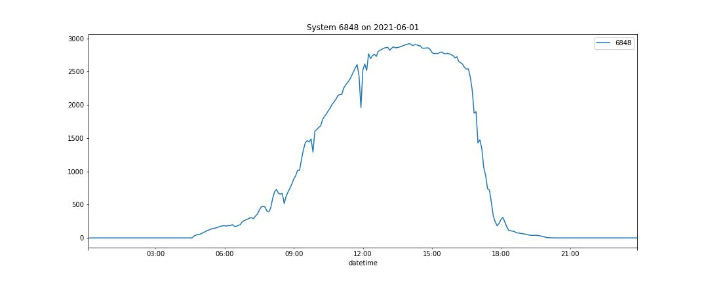
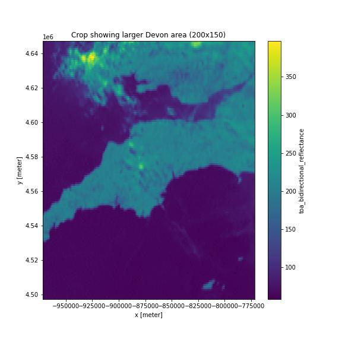

# Dissertation

This dissertation seeks to use satellite imagery to predict solar photovoltaic (PV) yield. 

For example, here is a comparison of the satellite images for Devon and the solar PV yield from a site in Devon, both for 2021-06-01.  

  

  

## Data sources

1. **uk_pv**: PV solar generation data from the UK. This dataset contains data from 1311 PV systems from 2018-01-01 to 2021-10-27. Originally from Sheffield Solar, aggregated by OCF and made available on HuggingFace [here](https://huggingface.co/datasets/openclimatefix/uk_pv).

  

2. **GSPs**: Geospatial boundaries associated with each of the Grid Supply Points on the GB transmission network. Provided by nationalgridESO [here](https://data.nationalgrideso.com/system/gis-boundaries-for-gb-grid-supply-points). 

  

3. **eumetstat_uk_hrv (devon-crop.zarr)**: Satellite imagery. The EUMETSAT Spinning Enhanced Visible and InfraRed Imager (SEVIRI) rapid scanning service (RSS) takes an image of the northern third of the Meteosat disc every five minutes. This Google Cloud dataset is from a single channel: the "high resolution visible" (HRV) channel; and contains data from January 2020 to November 2021. Original data from EUMETSTAT, convered into xarray zarr store by OCF, made available on Google Cloud Platform [here](https://console.cloud.google.com/marketplace/product/bigquery-public-data/eumetsat-seviri-rss-hrv-uk). Originally dataset is 100GB, cropped to only include Devon (100x100x170K) dataset to make training easier. 

  

  

  

